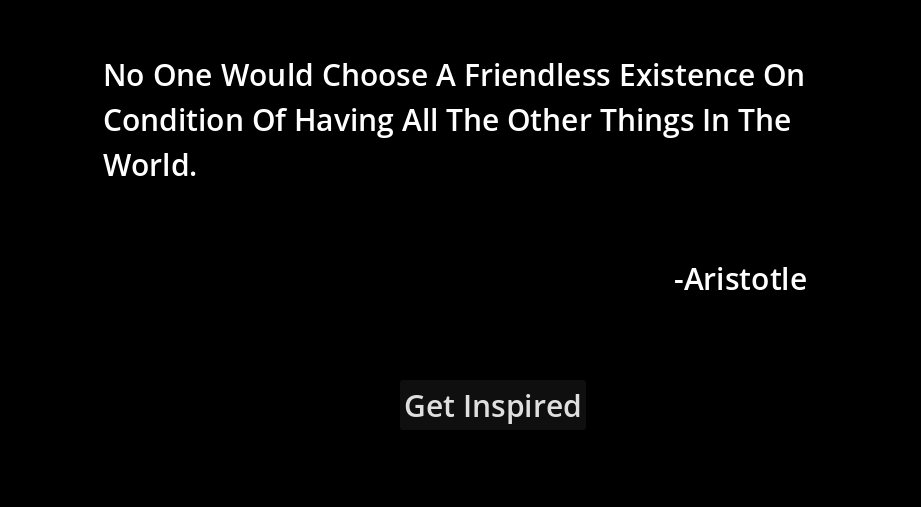

# 💬 Inspirational Quote Generator

A lightweight quote application built with **Godot 4.6 (.NET)** and **C#** that retrieves inspirational quotes from a public API and displays them in a clean, distraction-free interface.

---

## ✨ Features

- 🌐 Fetch random inspirational quotes from a public API
- 👤 Display quote author
- 🔄 Generate a new quote with a single button press
- 📱 Android compatible
- ⚡ Lightweight and responsive interface

---

## 🎯 Design Philosophy

This project follows a **minimalist and lightweight** design philosophy.

Instead of focusing on excessive visual effects or unnecessary complexity, the application prioritizes clarity, usability, and responsiveness. Every feature included serves a practical purpose, allowing users to focus on reading and reflecting on inspirational quotes without distractions.

The lightweight architecture also keeps the application accessible across a wide range of hardware, making it suitable for both modern and older systems while maintaining a smooth user experience.

**Core principles:**
- 🎯 Clean and intuitive interface
- ⚡ Lightweight and responsive
- 📖 Focused on the reading experience
- 🌍 Accessible across a wide range of devices

---

## 🛠️ Built With

- Godot Engine 4.6 (.NET)
- C#
- HTTPRequest
- System.Text.Json
- DummyJSON Quotes API

---

## 🌐 API

This application retrieves random quotes using the public **DummyJSON Quotes API**.

---

## 🚀 How to Run

1. Clone this repository.
2. Open the project using **Godot 4.6 (.NET)**.
3. Build the C# project.
4. Run the project.

---

## 📸 Screenshots

> Add screenshots of your application here.

### Quotes

---

## 📋 Project Requirements Implemented

✔ Retrieve random inspirational quotes from a public API

✔ Display quote text

✔ Display quote author

✔ Lightweight user interface

---

## 📄 License

Developed as part of the **InternGrow App Development Internship** for educational purposes.
